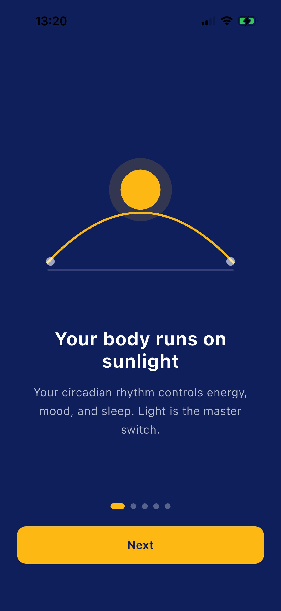
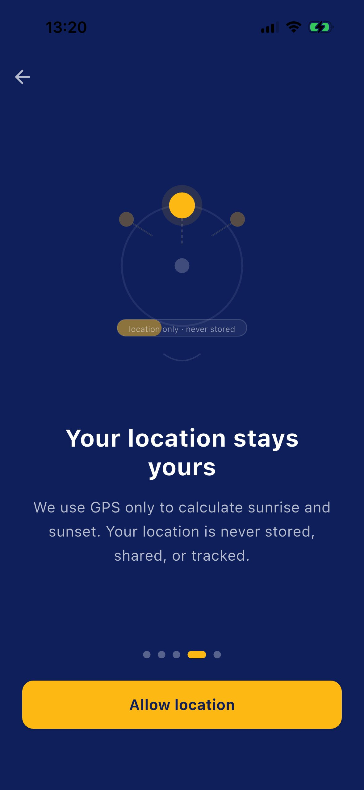
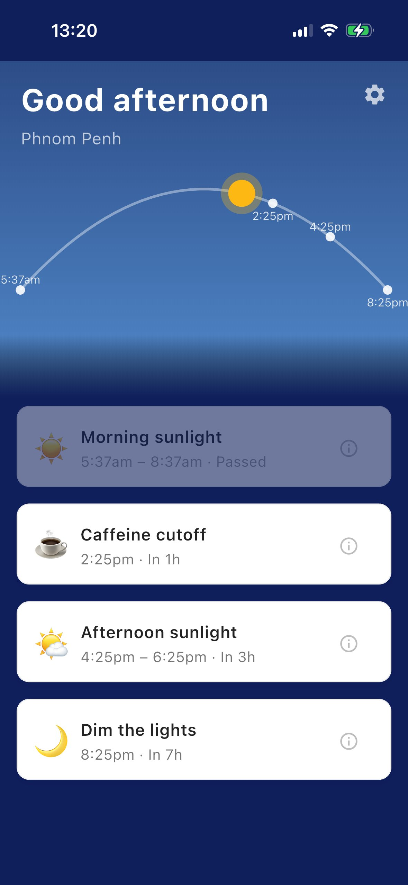
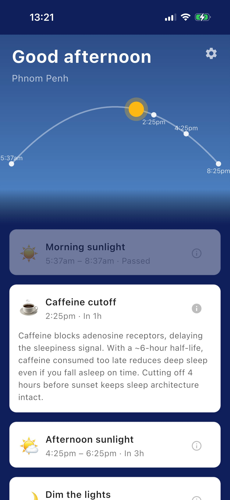

# Helio

A solar-anchored circadian rhythm app for digital nomads and frequent travelers, built with Flutter.

Helio calculates your local sunrise and sunset via GPS, then tells you exactly when to get morning sunlight, catch afternoon light, cut off caffeine, and dim the lights — all recalculated automatically as you move between cities and time zones.

<p align="center">
  
  
  
  
</p>

## Why this app exists

Most circadian rhythm advice online is written for someone living in one place, in one timezone, with a fixed routine. That's not the reality for digital nomads. Sunrise in Phnom Penh is not sunrise in Tokyo, and a fixed "get sunlight by 8am" rule breaks down the moment you cross a few timezones.

Helio replaces fixed clock times with solar-anchored ones. Every cue — morning light, afternoon light, caffeine cutoff, and wind-down — is calculated from your actual local sunrise and sunset, so the schedule adapts automatically wherever you are.

## Features

- **Real solar calculations.** Sunrise and sunset are computed on-device using astronomical algorithms based on GPS coordinates — no API calls, fully offline-capable.
- **Live sky visualization.** A custom-painted sun arc shows your position in the day, with the sky's color shifting continuously from dawn to dusk.
- **Four daily cues**, each anchored to solar events rather than fixed clock times:
  - Morning sunlight (sunrise to sunrise + 3 hours)
  - Afternoon sunlight (2 hours before sunset)
  - Caffeine cutoff (4 hours before sunset)
  - Dim the lights (2 hours after sunset)
- **Local notifications** for each cue, scheduled entirely on-device.
- **Reverse geocoding** to show your current city by name.
- **Five-screen onboarding** explaining the science and requesting permissions with context, not cold system dialogs.
- **Privacy-first** — location is used only for the solar calculation and is never stored or transmitted.

## Tech stack

- **Flutter / Dart**
- **Architecture:** MVVM + repository pattern
- **State management:** `ValueNotifier` with sealed classes for view state (`ScheduleLoading` / `ScheduleSuccess` / `ScheduleError`)
- **Dependency injection:** `get_it`
- **Key packages:**
  - `geolocator` — GPS access and permission handling
  - `geocoding` — reverse geocoding for city names
  - `solar_calculator` — offline astronomical sunrise/sunset calculation
  - `flutter_local_notifications` + `timezone` + `flutter_timezone` — scheduled local notifications across timezones
  - `shared_preferences` — onboarding state and user settings
  - `flutter_svg` — custom onboarding illustrations
- **Custom rendering:** the sky and sun arc are drawn with Flutter's `CustomPainter` API — a gradient sky that interpolates through color keyframes across the day, a quadratic bezier arc, and a sun position computed from the same bezier math.

## Architecture overview

```
lib/
├── models/             # CircadianSchedule, LocationData — pure data, no logic
├── repositories/        # LocationRepository, SunTimesRepository — single responsibility data sources
├── viewmodels/          # ScheduleViewModel — sealed state, orchestrates repositories
├── services/            # NotificationService
├── screens/
│   ├── painters/         # SkyPainter (CustomPainter)
│   ├── widgets/          # CueCard
│   ├── home_screen.dart
│   ├── onboarding_screen.dart
│   └── settings_screen.dart
└── main.dart            # get_it registration, app entry point
```

The app follows the same MVVM + repository pattern as my first Flutter project, [Lead Tracker](https://github.com/mikeb1869/lead-tracker), with repositories returning plain data models, a viewmodel exposing a single sealed state object, and the UI doing nothing but reading that state.

## What I learned building this

This was my second Flutter app and a deliberate step up in complexity from my first. A few things stood out:

**`CustomPainter` is a different mental model than composing widgets.** Building the sky and sun arc meant thinking in terms of canvas coordinates, bezier curves, and paint objects rather than nested widgets. Getting the sun to track correctly along a quadratic bezier path — and getting cue markers to sit at the right point on that same curve — required actually working through the bezier point formula by hand rather than copying a snippet.

**Timezone handling is harder than it looks.** The most frustrating bug in this project was a chain of UTC/local time conversion errors between the `solar_calculator` package's `Instant` type and Dart's native `DateTime`. What looked like a one-line `.toLocal()` fix actually required understanding that the third-party library's `Instant` carried a UTC timestamp with a misleading offset label, and the real fix was reconstructing a local `DateTime` directly from the UTC components plus a manually-applied offset. It took several rounds of debug-printing intermediate values at every step to isolate where the conversion was breaking.

**Sealed classes are worth the upfront cost.** Modeling view state as `ScheduleLoading` / `ScheduleSuccess` / `ScheduleError` instead of a handful of separate booleans made the UI logic far easier to reason about, and Dart's exhaustive `switch` meant the compiler caught cases I would have otherwise missed.

**Best-effort failure handling matters for UX.** Reverse geocoding and notification scheduling both fail occasionally (no internet, permission denied, etc.), and the app should degrade gracefully rather than showing an error for a non-critical feature. Wrapping those calls in their own try/catch blocks, separate from the core schedule-loading logic, was a small architectural decision that mattered more than it seemed at first.

**AI-assisted development, with a clear division of labor.** I built this app working with Claude (Anthropic) as a development partner. I wrote and debugged the core logic — the solar calculation pipeline, the timezone fix, the circadian math — myself, and made every product and architecture decision (state management approach, what goes in the data model, naming, ASO strategy). Claude helped with boilerplate, explained unfamiliar APIs and Flutter concepts like `CustomPainter` and sealed classes, reviewed my code for correctness, and helped me think through UX and product decisions. It's a workflow closer to pairing with a senior engineer than autocomplete, and one I expect to keep using as I take on more complex projects.

## Setup

```bash
git clone https://github.com/mikeb1869/circadian-optimizer.git
cd circadian-optimizer
flutter pub get
flutter run
```

Requires Flutter 3.x and a physical device or simulator with location services enabled (the iOS Simulator does not provide real GPS — use **Features → Location → Custom Location** to test, or run on a physical device for accurate results).

## Privacy

Helio's privacy policy is available at [https://mikeb1869.github.io/circadian-optimizer/privacy-policy.html](https://mikeb1869.github.io/circadian-optimizer/privacy-policy.html).

## License

MIT
